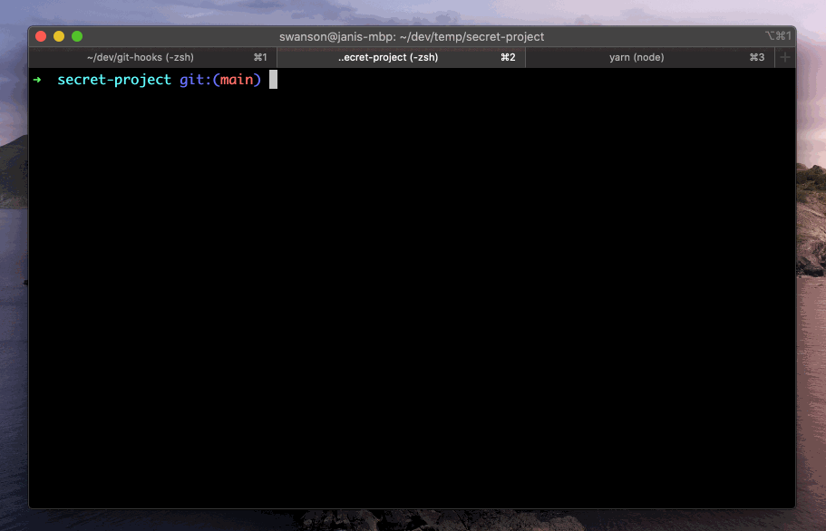
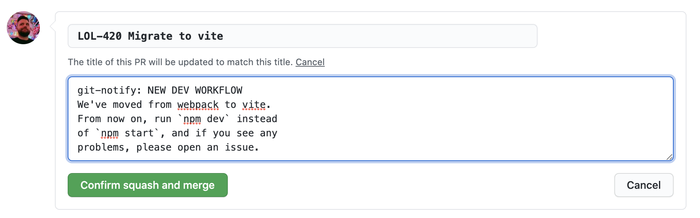

<h1 align="center">git-notify</h1>
<p align="center">
<strong>Communicate important updates to your team via git commit messages</strong>
<br><br>

## What is git-notify?

Sometimes you want to communicate about important changes, process improvements, new tools etc. to other developers on your project. In a small team, a Slack message will probably do the job, but in larger teams and distributed organizations (such as open source project), reaching everyone can be a pain.

`git-notify` allows you to inject announcements into your git commit messages, that will be displayed to other developers when they pull the changes to their machine.

```sh
git commit -m 'git-notify: NEW PERF TOOLING AVAILABLE ...'
```



Or, instead of adding messages to individual commits, you can add them to the extended merge/squash commit message on GitHub:



You can change the prefix [git-notify] uses. See [Configuration](#configuration) for how to do this.

## Getting started

Install the git-notify package as a devDependency to your project:

```bash
# using npm
npm install --save-dev git-notify

# using yarn
yarn add -D git-notify
```

You'll need to install [git hooks](https://git-scm.com/book/en/v2/Customizing-Git-Git-Hooks) to run `git-notify` automatically when other developers pull commits that contain git messages.

Below we show how to install them with the excellent [husky](https://github.com/typicode/husky) node library. For other approaches, see the [Git Hooks](#git-hooks) section.

### Installing hooks with husky

```
# using npm
npm install --save-dev husky@4

# using yarn
yarn add -D husky@4
```

Configure `git-notify` hooks by adding the following `husky` entries to your `package.json`:

```json
{
  //...snip
  "husky": {
    "hooks": {
      "post-merge": "git-notify merge $HUSKY_GIT_PARAMS",
      "post-rewrite": "git-notify rewrite $HUSKY_GIT_PARAMS",
      "post-checkout": "git-notify checkout $HUSKY_GIT_PARAMS"
    }
  }
}
```

**Note:** The above instructions below are for [husky v4.x](https://github.com/typicode/husky/tree/master). Husky v5 changes how hooks are configured, as well changes its licensing terms to be free only to other open source projects. See [husky's own documentation](https://dev.to/typicode/what-s-new-in-husky-5-32g5) for how to configure hooks in their latest version.

## Configuration

- `--prefix "\@team:"`
  - Change the prefix `git-notify` looks for in git commit messages
  - You'll need to take care of escaping any special characters that may be interpreted by your shell, `!`, `@`, etc...
  - Default: `git-notifier:`
- `--color "ff6f6f"`
  - Change the color of the banner
  - This can be one of the [`chalk` preset colors](https://www.npmjs.com/package/chalk#colors) or a HEX value. If using HEX value, you can either include or omit the leading `#` character.
- `--simple`
  - Instead of a fancy banner, displays a simple text message

### All parameters

Run `npx git-notify --help` for an up to date list of parameters:

```sh
npx git-notify --help

  Usage
    $ git-notify <method> [options] $GIT_PARAMS

   Methods
     since <commit>  show all notifications since commit
     merge           run on git pull/merge
     rewrite         run on git rebase
     checkout        run on git checkout/switch

  Options
     --prefix, -p    prefix to  look for in commit messages (default: "git-notify:")
     --simple, -s    show a plain, unboxed notification
     --color, -c     color of displayed notification

  Examples
     $ git-notify since HEAD~5
     $ git-notify checkout $GIT_PARAMS
```

## About formatting

`git-notify` will display a message for every "git-notify:" prefix it finds in the commit log that was just pulled/merged/rebased/checked out. **The notification message will be the rest of the paragraph following the prefix.** Whitespace will be preserved.

For example, this commit message:

```
This change upgrades some of our dependencies. git-notify: Please run npm install
```

Will print:

```
            ╒════════════════════════════╕
            │                               │
            │    Please run npm install     │
            │                               │
            ╘════════════════════════════╛
```

Or:

````
Rewrite everything.

git-notify:EVERYTHING HAS CHANGED
This project has been rewritten
from scratch. If something broke,
please contact Jeff at dev@null.com.
```

Will display:
```
         ╒══════════════════════════════════════════╕
         │                                              │
         │            EVERYTHING HAS CHANGED            │
         │       This project has been rewritten        │
         │      from scratch. If something broke,       │
         │     please contact Jeff at dev@null.com.     │
         │                                              │
         ╘══════════════════════════════════════════╛


### Can I group messages

Not at the moment, but this should not be difficult to add. See [Contributing](#contributing)

## Git Hooks

### Installing with husky

See [Installing hooks with husky](#installing-hooks-with-husky) in the Getting Started section.

### Installing hooks by any other means

`git-notify` is agnostic to however you want to install your git hooks.

The hooks you need to configure are:

- **post-merge** (runs on `git pull` and `git merge`)
  - `npx git-notify merge $GIT_PARAMS`
- **post-rewrite** (runs on `git rebase`)
  - `npx git-notify rewrite $GIT_PARAMS`
- **post-checkout** (runs on `git checkout` -- optional, but useful)
  - `npx git-notify checkout $GIT_PARAMS`

At the time of writing, `git-notify checkout` is the only hook that uses the arguments (`$GIT_PARAMS`) passed to the git hook, but ideally you should always pass the arguments to `git-notify`, in case we'll need to use them in a later version.

See [githooks.com](https://githooks.com/) for more resources on the topic. Documentation for different approaches are welcome!

### Installing git-notify without npm

At this time, `git-notify` is a node-based project. While I recognize it could be useful in other types of projects (ruby, python, rust, etc...), cross-platform scripting sucks, and this project is not interested in solving those problems at this time.

If you like this idea, feel free to steal it and implement your own version for other toolsets!

## Contributing

This project is open to contributions. For anything that would radically change the nature of the project or increase its maintenance burden, please open an issue first to discuss.

### Local development

This project is written in TypeScript and scaffolded using [tsdx](https://github.com/formium/tsdx).

To run TSDX, use:

```bash
yarn start
````

This builds to `/dist` and runs the project in watch mode so any edits you save inside `src` causes a rebuild to `/dist`.

To do a one-off build, use `npm run build` or `yarn build`.

To run tests, use `npm test` or `yarn test`.

## LICENSE

[MIT](LICENSE)
